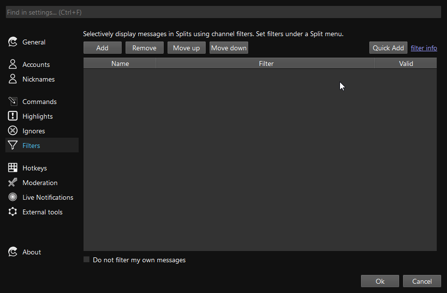

Filters are a powerful tool to create your own custom, filtered channel splits. Filters allow you to selectively show messages that satisfy your own custom criteria: show subscribers' messages, moderator messages, channel point redemptions, new subscriptions, and more.

Looking for inspiration? Look at some [example filters](#example-filters).

## Introduction to Filters

Filters can be applied to splits to provide a selective view of messages. Filters are created in the Settings page and are applied by opening the Split menu (three dots) and selecting "Set filters". Applied filters are saved when you close and open Chatterino.

Multiple filters can be applied to a Split. A message must pass all applied filters for it to be displayed.

Simple filters are available through the Channel Filter Creator dialog. Advanced filters take inspiration from many programming languages, and the full description of keywords and operators can be found below.

### Writing your own filters

To begin writing your own filters, take a look at the available [operators](#operators) and [variables](#variables) below.

For most tasks involving the message content, you can make use of the `contains` operator, or the `matches` operator with a [regular expression](https://en.wikipedia.org/wiki/Regular_expression).  
Then, try to break your desired behavior into multiple conditions. Combine them like this:

-   If you need _all_ the conditions satisfied, combine them with AND (`condition1 && condition2`)
-   If you only need _one_ of the conditions, combine them with OR (`condition1 || condition2`)
-   If you need the _opposite_ of one of the conditions, wrap it with parentheses and add a NOT: `!(condition)`

#### Example

Consider the following intention: "Only show me messages that are from moderators **and** mention me". We can break this filter into two individual conditions:

1. Messages that are from moderators
2. Messages that mention me

We can then write the corresponding filter parts:

1. `author.badges contains "moderator"`
2. `message.content contains "@my_name"`

Finally, because we want _both_ of these conditions to be true, we combine them with the AND operator `&&` and end up with this final filter:

`(author.badges contains "moderator") && (message.content contains "@my_name")`

### Quick Add

If you already have a filter, you can use the `Quick Add` button and paste your filter into the `Filter` section.

### Terminology

Here is some terminology that you'll encounter in the rest of this document.

1. Value: A value is the simplest element of a filter. It can take on multiple forms: a number, a string (i.e. text), a [regular expression](https://en.wikipedia.org/wiki/Regular_expression), or a list of multiple values.
2. Type: A type describes the general form of a value. For example, every number has type Int. Every string has type String.
3. Variable: A variable is a placeholder for some information about a message. For example, the variable `message.content` represents the text of a message
4. Operator: An operator acts on one or two values and evaluates to another value. For example, the plus operator `+` can add two numbers, `1 + 1` or concatenate strings, `"a" + "b"`

## Example filters

-   `message.content contains "hello"`
    -   Only messages that contain the phrase `hello`
-   `message.length < 40 || author.subbed`
    -   Messages that are less than 40 characters long, OR are sent by a subscriber.
-   `channel.name == "somestreamer" && author.badges contains "moderator"`
    -   Messages that originated in the channel `somestreamer` AND are from users with a moderator badge

## Filter Syntax + Semantics

This section is aimed at technical users who have experience with general purpose programming languages.

A filter must be a valid expression. An expression is comprised of conditions and values which are evaluated to a single `True` or `False` value to decide whether to filter a message. Evaluating to something other than `True` or `False` will lead to all messages being filtered out.

### Values

A value can be:

1. An integer (`123`, `5`)
2. A string (`"hello"`, `"this is a string"`)
3. A variable (`author.name`, `message.length`)
    - Technically, a variable isn't a value, but is given value by substitution
    - When a filter is evaluated, variables are replaced with the values they represent
4. A regular expression (`r"\d\d\d\d"`)
5. A list of values (`{123, "hello", author.name}`)

Regular expressions are similar to strings, but are denoted with an `r` before the opening quotation mark (e.g. `r"something"`). To make a regular expression case-insensitive, use `ri` before the opening quotation mark (e.g. `ri"something"`).

**Literals:**

| Name   | Example                               |
| ------ | ------------------------------------- |
| Int    | `123`, `5`                            |
| String | `"Hello there"`, `"Escaped \" quote"` |
| RegEx  | `r"\d\d\d\d"`, `ri"something.*"`      |
| List   | `{"list item", 123}`                  |

### Operators

Binary operators act on two values:

-   `1 + 2`
-   `author.subbed && flags.highlighted`
-   `"long sentence" contains "ten"`

Unary operators act on one value:

-   `!author.subbed`

The following operators are available:

| Operator            | Description                                                      |
| ------------------- | ---------------------------------------------------------------- |
| `&&`                | [Logical AND](https://en.wikipedia.org/wiki/Logical_conjunction) |
| <code> \|\| </code> | [Logical OR](https://en.wikipedia.org/wiki/Logical_disjunction)  |
| `!`                 | [Negation](https://en.wikipedia.org/wiki/Negation)               |
| `==`                | Equals                                                           |
| `!=`                | Not equals                                                       |
| `<`                 | Less than                                                        |
| `<=`                | Less than or equal to                                            |
| `>`                 | Greater than                                                     |
| `>=`                | Greater than or equal to                                         |
| `contains`          | String, List, or Map contains                                    |
| `startswith`        | String or List starts with text or value, respectively           |
| `endswith`          | String or List ends with text or value, respectively             |
| `match`             | Match string with regular expression                             |
| `+`                 | Add (or string concatenation)                                    |
| `-`                 | Subtract                                                         |
| `*`                 | Multiply                                                         |
| `/`                 | Divide (integer)                                                 |
| `%`                 | Modulus                                                          |

Please read about the [type rules](#type-rules) to better understand the evaluation semantics for operators that take multiple data types.

### Variables

The following variables are available:

| Variable                | Type         | Description                                                                                    |
| ----------------------- | ------------ | ---------------------------------------------------------------------------------------------- |
| **Author**              |              | User who sent the message                                                                      |
| `author.badges`         | List<String> | List of author's badges                                                                        |
| `author.color`          | Color\*      | Color code of author, or none                                                                  |
| `author.name`           | String       | Display name of author                                                                         |
| `author.no_color`       | Bool         | Whether the author has no color set (i.e. gray name)                                           |
| `author.subbed`         | Bool         | Whether author is subscribed                                                                   |
| `author.sub_length`     | Int          | How long author has been subscribed (or zero)                                                  |
| **Channel**             |              | The channel where the message was sent                                                         |
| `channel.name`          | String       | Channel name                                                                                   |
| `channel.watching`      | Bool         | Whether the channel is being watched (requires Chatterino extension)                           |
| `channel.live`          | Bool         | Whether the channel is currently live                                                          |
| **Flags**               |              | Message-specific flags                                                                         |
| `flags.action`          | Bool         | Weather the message was sent with `/me`                                                        |
| `flags.automod`         | Bool         | Whether the message has automod information or actions                                         |
| `flags.cheer_message`   | Bool         | Whether the message includes bits                                                              |
| `flags.first_message`   | Bool         | Whether the message is the author's first message in the channel                               |
| `flags.highlighted`     | Bool         | Whether the message is highlighted                                                             |
| `flags.points_redeemed` | Bool         | Whether the message was redeemed through the channel point reward "Highlight my Message"       |
| `flags.reply`           | Bool         | Whether the message is a reply                                                                 |
| `flags.restricted`      | Bool         | Whether the message comes from a restricted user                                               |
| `flags.reward_message`  | Bool         | Whether the message is a redeemed channel point reward message (except "Highlight my Message") |
| `flags.shared`          | Bool         | Whether the message comes from a another channel                                               |
| `flags.sub_message`     | Bool         | Whether the message is a sub/resub/gift message                                                |
| `flags.system_message`  | Bool         | Whether the message is a system message (i.e. timeout/ban/info)                                |
| `flags.whisper`         | Bool         | Whether the message is a whisper                                                               |
| **Message**             |              | Actual message sent                                                                            |
| `message.content`       | String       | Message content                                                                                |
| `message.length`        | Int          | Message length                                                                                 |
| **Reward**              |              | Information about the channel point redemption of this message, if any                         |
| `reward.title`[^1]      | String       | Title of the redemption (e.g. Drink water!)                                                    |
| `reward.cost`[^1]       | Int          | Cost of the redemption (e.g. 500)                                                              |
| `reward.id`[^1]         | String       | ID of the redemption (e.g. 1ed437f5-9dc3-4510-8a3f-abcad67985e1)                               |

\*Note: To compare a `Color`, compare it to a color hex code string: `author.color == "#FF0000"`

### Data types

The Chatterino filter language is typed, meaning that every value has a type and only specific combinations of types are allowed when using operators. Generally, you won't run in to issues. The type system exists to warn you about any mistakes that your filter contains.

#### Type Rules

| Operator          | Form                            | Result   | Description                                                    |
| ----------------- | ------------------------------- | -------- | -------------------------------------------------------------- |
| `+`               | `Int + Int`                     | `Int`    | Adds two integers                                              |
| `+`               | `String + Any`                  | `String` | Concatenates the first string with the second argument         |
| `-`               | `Int - Int`                     | `Int`    | Subtracts two integers                                         |
| `*`               | `Int * Int`                     | `Int`    | Multiplies two integers                                        |
| `/`               | `Int / Int`                     | `Int`    | Divides two integers, discarding the remainder                 |
| `%`               | `Int % Int`                     | `Int`    | Computes the modulus of two integers                           |
| `&&`              | `Bool && Bool`                  | `Bool`   | Logical AND of two booleans                                    |
| <code>\|\|</code> | <code>Bool \|\| Bool</code>     | `Bool`   | Logical OR of two booleans                                     |
| `==`              | `Any == Any`                    | `Bool`   | Equality comparison of any two values                          |
| `!=`              | `Any != Any`                    | `Bool`   | Inequality comparison of any two values                        |
| `>`               | `Int > Int`                     | `Bool`   | Greater than comparison of two integers                        |
| `>=`              | `Int >= Int`                    | `Bool`   | Greater than or equal to comparison of two integers            |
| `<`               | `Int < Int`                     | `Bool`   | Less than comparison of two integers                           |
| `<=`              | `Int <= Int`                    | `Bool`   | Less than or equal to comparison of two integers               |
| `startswith`      | `List startswith Any`           | `Bool`   | Checks whether the list has the given value as its first value |
| `startswith`      | `String startswith String`      | `Bool`   | Checks whether the first string starts with the second string  |
| `endswith`        | `List endswith Any`             | `Bool`   | Checks whether the list has the given value as its last value  |
| `endswith`        | `String endswith String`        | `Bool`   | Checks whether the first string ends with the second string    |
| `contains`        | `List contains Any`             | `Bool`   | Checks whether the list contains the given value               |
| `contains`        | `Map contains Any`              | `Bool`   | Checks whether the map has the given value as a key            |
| `contains`        | `String contains String`        | `Bool`   | Checks whether the first string contains the second string     |
| `match`           | `String match RegEx`            | `Bool`   | Checks whether the string matches the given regular expression |
| `match`           | `String match {RegEx, n : Int}` | `String` | Returns the `n`th matching capture group, or the empty string  |

### Regular Expressions

Chatterino can match string variables to a regular expression, returning whether the expression matched or, optionally, the value of a capture group.

#### Simple matching

`"some string" match r"some regex"` returns `True` or `False`.

For example: `message.content match r"\d\d"`

#### Group capturing

`"some string" match {r"some regex", capture number}` returns `False` if no match or the value of the nth captured group.

For example: `message.content match {r"(\d\d)/(\d\d)/(\d\d\d\d)", 3}` matches the year component of a date like `12/31/2020`.

`(message.content match {r"(\d\d)/(\d\d)/(\d\d\d\d)", 3}) == "2020"` will filter only messages that contain a written date with 2020 as the year.

### Order of Operations

The order of operations in filters may not be exactly what you expect.

-   Expressions in parentheses are evaluated first
-   Math operations are evaluated from left to right, not by MDAS. `2 + 3 * 4` yields `20`, not `14`.
-   `a && b || c && d` is evaluated as `(a && b) || (c && d)`
-   `a || b && c || d` is evaluated as `a || (b && c) || d`

Basically, if you're unsure about the order of operations, use extra parentheses.

[nightly]: ../Help/#what-is-nightly-and-how-to-use-install-it

[^1]: Available since 2.5.1
