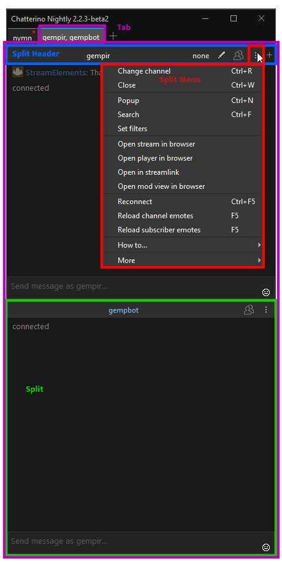
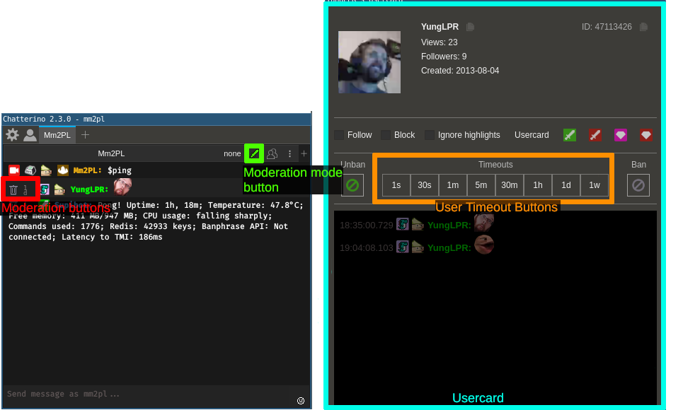

# Glossary

Explain common words used in Chatterino.

## Anatomy of a Chatterino window

|Term|Description|
|-|-|
|Split|Includes the chat, input field and a split header|
|Split Header|Contains split title, moderation actions, Viewer List, split menu button and add split button|
|Split Menu|Settings or actions for the specific split|
|Tab|Can contain multiple splits|

## Moderation

|Term|Description|
|-|-|
|Moderation buttons|Allow you to quickly delete messages, timeout users or execute custom commands. They can be configured in Settings > Moderation > Moderation buttons|
|Moderation mode button|Toggles whether Moderation buttons are shown|
|Usercard|Contains useful information about a user, action buttons as well as their recent messages. Can be opened by clicking someone's username in chat or by typing `/usercard username`|
|User Timeout Buttons|Allow you time a user out from their Usercard. They can be configured in Settings > Moderation > User Timeout Buttons|
