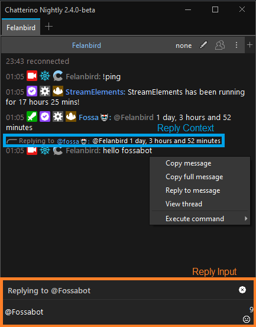
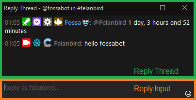

# Glossary

Explain common words used in Chatterino.

## Anatomy of a Chatterino window

| Term         | Highlight | Description                                                                                    |
| ------------ | --------- | ---------------------------------------------------------------------------------------------- |
| Split        | Green     | Includes the chat, input field and a split header.                                             |
| Split Header | Blue      | Contains split title, moderation actions, viewer list, split menu button and add split button. |
| Split Menu   | Red       | Settings or actions for the specific split.                                                    |
| Tab          | Purple    | Can contain multiple splits.                                                                   |

## Moderation

| Term                   | Highlight | Description                                                                                                                                                                        |
| ---------------------- | --------- | ---------------------------------------------------------------------------------------------------------------------------------------------------------------------------------- |
| Moderation buttons     | Red       | Allow you to quickly delete messages, timeout users or execute custom commands. They can be configured in Settings > Moderation > Moderation buttons.                              |
| Moderation mode button | Green     | Toggles whether Moderation buttons are shown.                                                                                                                                      |
| Usercard               | Aqua      | Contains useful information about a user, action buttons as well as their recent messages. Can be opened by clicking someone's username in chat or by typing `/usercard username`. |
| User Timeout Buttons   | Orange    | Allow you time a user out from their Usercard. They can be configured in Settings > Moderation > User Timeout Buttons.                                                             |

## Replies

| Term          | Highlight | Description                                                                                          |
| ------------- | --------- | ---------------------------------------------------------------------------------------------------- |
| Reply Context | Blue      | Contains the message a user was replying to.                                                         |
| Reply Thread  | Green     | Contains the history of replies to a message that Chatterino has loaded.                             |
| Reply Input   | Orange    | The input box to send a reply. Available in both the normal Chatterino window, and the Reply Thread. |
