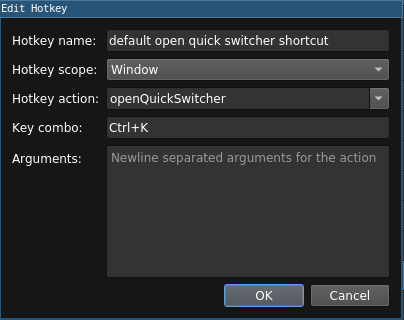

## Introduction to Custom Hotkeys

By default Chatterino contains a set of default *hotkeys*. A hotkey can be described using five parameters:

- Its name
- A [scope](#scopes)
- An [action](#actions)
- A key combo
- The [arguments](#arguments)

### Scopes

Scopes describe where in the app the hotkey's action take place. For example:

- Sending a message by pressing enter takes place in the **Split input box**,
- Closing the current split takes place in the current **Split**.

### Actions

An action simply describes what a hotkey does. For example:

- The **reconnect** action in a Split causes Chatterino to reconnect to Twitch/IRC.
- The **zoom** action in a Window causes Chatterino to zoom in or out (depending on the [arguments][#hotkey-arguments] given)

### Hotkey Arguments

Hotkey arguments describe the specifics of hotkeys. For example:

- The **zoom** action in a Window takes a single argument (`in` or `out`) which tells Chatterino to either zoom in or zoom out.
