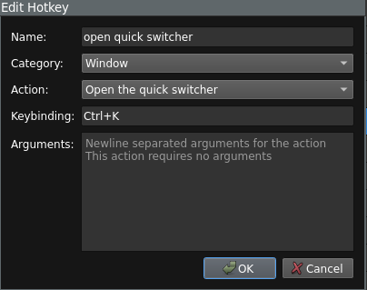

## Introduction to Hotkeys

By default Chatterino contains a set of default hotkeys. A hotkey can be described using five parameters:

- Its name
- A [category](#categories)
- An [action](#actions)
- A [keybinding](#keybindings)
- The [arguments](#arguments)

### Categories

Categories describe where in the app the hotkeys action takes place. For example:

- Sending a message by pressing enter takes place in the **Split input box**,
- Closing the current split takes place in the current **Split**.

### Actions

An action simply describes what a hotkey does. For example:

- The **Reconnect to chat** action in a Split causes Chatterino to reconnect to Twitch/IRC.
- The **Zoom in/out** action in a Window causes Chatterino to zoom in or out (depending on the [arguments](#arguments) given)

### Keybindings

TODO: Short blurb how more advanced keybindings work

### Arguments

Arguments describe the specifics of how the action will behave. For example:

- The **Zoom in/out** action in a Window takes a single argument (`in`, `out`, or `reset`) which tells Chatterino to either zoom in or zoom out.
