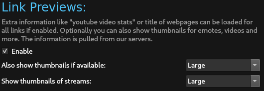

Link Previews make it easy to check what's behind a link withou visiting the link in the browser.
All links go through [github.com/chatterino/api](https://github.com/chatterino/api) to protect your IP from any leaks.

# Enabling

By default link previews are disabled. Turn them on under "Link Previews" in the settings.
Optionally also turn on thumbnails in your preferred size for an even richer link experience.

# Supported Links

By default chatterino will use [Open Graph](https://ogp.me/) tags to enrich tooltips. 
To enhance the tooltips even more we have some custom handling for the following sites:

- [Betterttv](https://betterttv.com/)
- [Discord](https://discord.com/)
- [FrankerFaceZ](https://www.frankerfacez.com/)
- [Imgur](https://imgur.com)
- [Livestreamfails](https://livestreamfails.com/)
- [Supinic](https://supinic.com/)
- [Twitch](https://twitch.tv)
- [Twitter](https://twitter.com)
- [YouTube](https://youtube.com)
- [Wikipedia](https://www.wikipedia.org/)

# Demo

