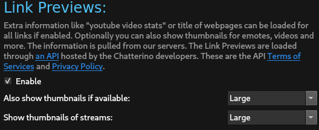
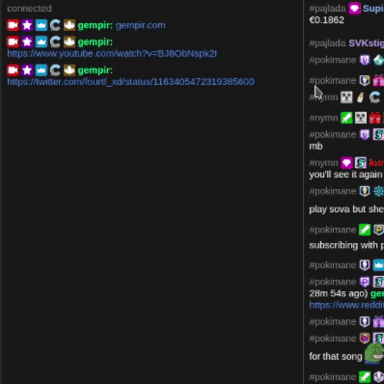

# Link Previews

Link Previews make it easy to check what's behind a link without visiting the link in the browser.
All links go through [github.com/chatterino/api](https://github.com/chatterino/api) to protect your IP from any leaks.

# Privacy Policy & Terms of Service

Enabling this feature means your client will send additional data to our API to power this feature.  
You should read the [Privacy Policy](https://braize.pajlada.com/chatterino/legal/privacy-policy) and [Terms of Service](https://braize.pajlada.com/chatterino/legal/terms-of-service) before enabling this feature.  
If you have any questions about this, please contact us through the [GitHub repo](https://github.com/Chatterino/chatterino2/issues/new/choose).

# Enabling

By default link previews are disabled. Turn them on under "Link Previews" in the settings.
Optionally also turn on thumbnails in your preferred size for an even richer link experience.

# Supported Links

By default chatterino will use [Open Graph](https://ogp.me/) tags to enrich tooltips.
To enhance the tooltips even more, we have custom integrations for the following sites:

- [BetterTTV](https://betterttv.com/)
- [Discord](https://discord.com/)
- [FrankerFaceZ](https://www.frankerfacez.com/)
- [Imgur](https://imgur.com)
- [Livestreamfails](https://livestreamfails.com/)
- [Supinic](https://supinic.com/)
- [Twitch](https://twitch.tv)
- [Twitter](https://twitter.com)
- [Wikipedia](https://www.wikipedia.org/)
- [YouTube](https://youtube.com)

# Demo

