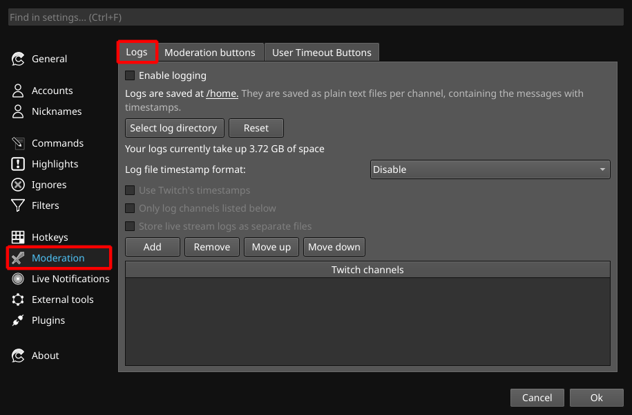
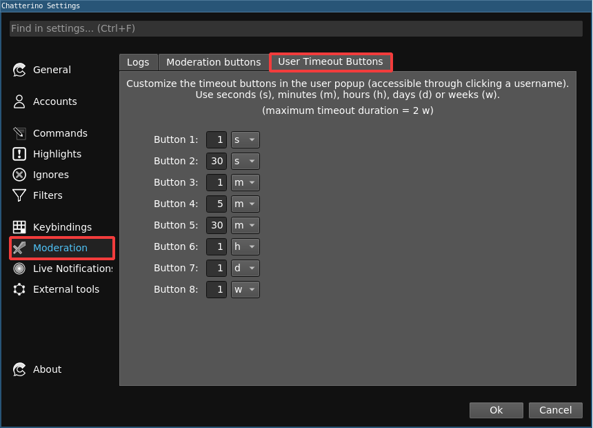

Chatterino contains a slew of features to assist moderators in moderating.

## Chat Mode
You can easily change the chat modes in Chatterino using the button on the streamer bar.

You can choose from: Emote only, Subscriber only, Slow mode, R9K mode and Followers only mode.

## Logging
Moderators are able to log all the channels they are in using the logging feature.

## Moderation Mode
Moderation mode is enabled by clicking {: width=18; height=18 } in a channel that you moderate. Available variables are `{user.name}`, `{msg-id}`[¹][note-1] & `{channel.name}`. Below is a list of examples that can be used:

| Function | Action |
| - | - |
| Ban a user | `/ban {user.name}` |
| Unban a user | `/unban {user.name}` |
| Timeout a user | `/timeout {user.name} 600` |
| Delete a user's message | `/delete {msg-id}`[¹][note-1] |
| pajbot2 report | `/w botname #{channel.name} !report {user.name} being rude` |
| pajbot2 longreport | `/w botname #{channel.name} !longreport {user.name} being very rude` |
| Open the user's usercard | `/user {user.name}` |
###### As of [nightly][nightly] [9b9fd7d][com1] `{msg.id}` can also be used. 

## User Timeout Buttons
User timeout buttons are very useful while looking at a user's logs. All 8 buttons can be configured to various timeout lengths:

User timeout buttons look like this:

[nightly]: ../Help/#what-is-nightly-and-how-to-use-install-it
[com1]: https://github.com/Chatterino/chatterino2/commit/9b9fd7d403a0b3bd047ba7134de158c4e2fecbc7
