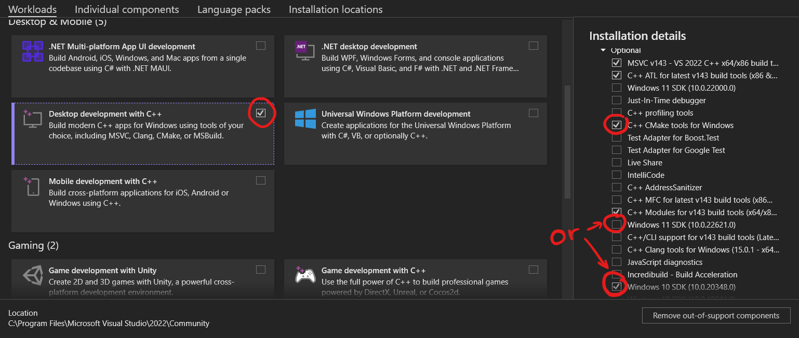
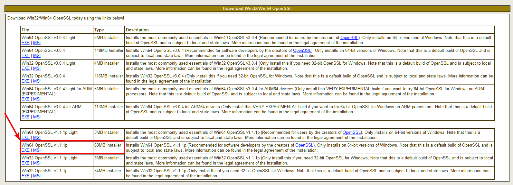
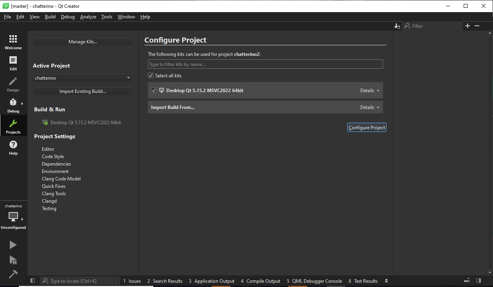
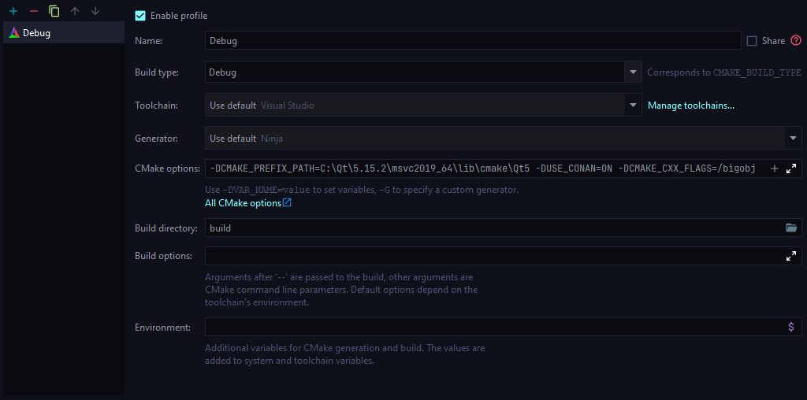
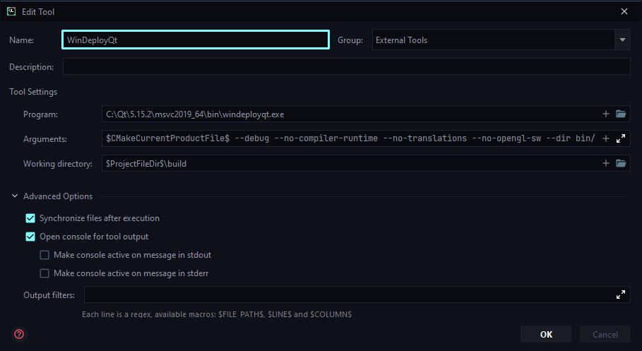
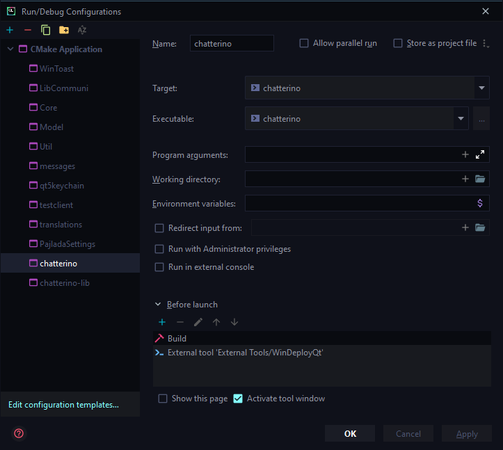

# Windows

**Note that installing all of the development prerequisites and libraries will require about 30 GB of free disk space. Please ensure this space is available on your drives and about 3 GB of free space for the Windows SDK on `C:` before proceeding.**

There are a few assumptions/decisions this guide makes:

1. You're on a 64bit operating system.
2. You want to use MSVC to compile.
3. You already have [git](https://git-scm.com/) installed.

This guide will walk you through [getting the code](#getting-the-code), [installing the required tools](#required-tools), [getting additional libraried](#additional-libraries), [setting up your editor](#editoride-setup), building, running, and debugging Chatterino.

## Getting The Code

Clone the repository or your fork in some folder:

```cmd
git clone --recurse-submodules https://github.com/Chatterino/chatterino2.git <optional-folder>
```

## Required Tools

### Visual Studio 2022 and Windows SDK

Download and install [Visual Studio 2022 Community](https://visualstudio.microsoft.com/downloads/).
In the installer, select "Desktop development with C++".

Notes:

-   If you don't have [CMake](https://cmake.org/) installed, make sure "C++ CMake tools for Windows" is selected.
-   This installation will take about 6-10 GB of total disk space. Feel free to change the installation location.
-   You do not need to sign in with a Microsoft account after setup completes. You may simply exit the login dialog.

<details markdown>
<summary>Screenshot of Visual Studio Installer</summary>



</details>

### Qt

If you want to use [vcpkg](#vcpkg), then you don't need to install Qt.

1. Visit the [Qt Open Source Page](https://www.qt.io/download-open-source).
2. Scroll down to the bottom
3. Then select "Download the Qt Online Installer"

<!-- TODO: Screenshot -->

#### When prompted which components to install

1. Unfold the tree element that says "Qt"
2. Unfold the top most tree element (latest stable Qt version, e.g. `Qt 5.15.2`)
3. Under this version, select the following entries:
    - `MSVC 2019 64-bit` (or alternative version if you are using that)
    - `Qt WebEngine` (optional)
4. Under the "Tools" tree element (at the bottom), ensure that `Debugging Tools for Windows` is selected (should be checked by default).
5. If you wish to use [Qt Creator](#qt-creator) as your editor, ensure that `Qt Creator X.X.X` is selected.
6. Continue through the installer and let the installer finish installing Qt.

Note: This installation will take about 2 GB of disk space.

<!-- TODO: Screenshot -->

## Additional Libraries

You need to get `boost` and `openssl` in order to compile. You can either download them manually or use a package manager like [conan](#conan) or [vcpkg](#vcpkg).

### Manual Download

<!-- TODO: This is a bit opinionated about the installation location -->

#### Boost

1. First, download a boost installer appropriate for your version of Visual Studio.

    - Visit the downloads list on [SourceForge](https://sourceforge.net/projects/boost/files/boost-binaries/).
    - Select the latest version from the list.
    - Download the `.exe` file appropriate to your Visual Studio installation version and system bitness (choose `-64` for 64-bit systems).
      Visual Studio versions map as follows: `14.3` in the filename corresponds to MSVC 2022,`14.2` to 2019. _Anything prior to Visual Studio 2019 is unsupported. Please upgrade should you have an older installation._

        **Convenience link for Visual Studio 2022: [boost_1_81_0-msvc-14.3-64.exe](https://sourceforge.net/projects/boost/files/boost-binaries/1.81.0/boost_1_81_0-msvc-14.3-64.exe/download)**

2. When prompted where to install Boost, set the location to `C:\local\boost`.
3. After the installation finishes, rename the `C:\local\boost\lib64-msvc-14.3` (or similar) directory to simply `lib` (`C:\local\boost\lib`).

Note: This installation will take about 2.1 GB of disk space.

#### OpenSSL

For our websocket library, we need OpenSSL 1.1.

1. Download OpenSSL for windows, version `1.1.1s`: **[Download](https://slproweb.com/download/Win64OpenSSL-1_1_1s.exe)**
2. When prompted, install OpenSSL to `C:\local\openssl`
3. When prompted, copy the OpenSSL DLLs to "The OpenSSL binaries (/bin) directory".

For Qt SSL, we need OpenSSL 1.0.

1. Download OpenSSL for Windows, version `1.0.2u`: **[Download](https://web.archive.org/web/20211109231823/https://slproweb.com/download/Win64OpenSSL-1_0_2u.exe)**
2. When prompted, install it to any arbitrary empty directory.
3. When prompted, copy the OpenSSL DLLs to "The OpenSSL binaries (/bin) directory".
4. Copy the OpenSSL 1.0 files from its `\bin` folder to `C:\local\bin` (You will need to create the folder)
5. Then copy the OpenSSL 1.1 files from its `\bin` folder to `C:\local\bin` (Overwrite any duplicate files)
6. Add `C:\local\bin` to your path folder ([Follow the guide here if you don't know how to do it](https://www.computerhope.com/issues/ch000549.htm#windows10))

**If the 1.1.x download link above does not work, try downloading the similar 1.1.x version found [here](https://slproweb.com/products/Win32OpenSSL.html). Note: Don't download the "light" installer, it does not have the required files.**


Note: This installation will take about 200 MB of disk space.

<!-- TODO: CMake flags -->

### conan

1. Install conan as described on [conan.io](https://conan.io/downloads.html) using pip or the installer.
2. Make sure the default profile (`~/.conan/profiles/default`) is set up to use Visual Studio. Or create a new one by using `conan profile new <name> --detect`.

```toml title="~/.conan/profiles/default"
[settings]
os=Windows
os_build=Windows
arch=x86_64
arch_build=x86_64
compiler=Visual Studio
compiler.version=17 # (1)!
build_type=Release # (2)!
[options]
[build_requires]
[env]
```

1. Your Visual Studio version.
2. This can be changed by `-s build_type=Debug` when installing.

In your cloned repository (e.g. `chatterino2`), open a terminal, create a `build` folder and install the dependencies:

```powershell
mkdir build && cd build && conan install .. -b missing -s build_type=Debug
```

If you want to use a specifc profile, add `-pr <name>` to the `conan` command. When [building a standalone version](#producing-standalone-builds), you want to set the `build_type` to `Release`.

In your editor, you need to add `-DUSE_CONAN=On` to the CMake confiugure command.

### vcpkg

1. Install [vcpkg](https://vcpkg.io/) (~80 MB)
    - `git clone https://github.com/Microsoft/vcpkg.git`
    - `cd .\vcpkg\`
    - `.\bootstrap-vcpkg.bat`
    - `.\vcpkg integrate install`
    - `.\vcpkg integrate powershell`
    - `cd ..`
2. Configure the environment for vcpkg
    - `set VCPKG_DEFAULT_TRIPLET=x64-windows`
        - [default](https://github.com/microsoft/vcpkg/blob/master/docs/users/triplets.md#additional-remarks) is `x86-windows`
    - `set VCPKG_ROOT=C:\path\to\vcpkg\`
    - `set PATH=%PATH%;%VCPKG_ROOT%` <!-- TODO: mention setx? -->
3. In your cloned repository (e.g. `chatterino2`), open a terminal, and install the dependencies:

```powershell
vcpkg install
```

In your editor, you need to add `-DCMAKE_TOOLCHAIN_FILE="$VCPKG_ROOT/scripts/buildsystems/vcpkg.cmake"` (where `$VCPKG_ROOT` is the `VCPKG_ROOT` environment variable) to the CMake confiugure command.

### Debugger Visualizations

To pretty print Qt types in a debugger, Qt provides natvis files.

Use the official NatVis file for QT from [`qt-labs/vstools`](https://github.com/qt-labs/vstools) by saving them to the project root using PowerShell:

<!--
When switching to QT6 these need to be updated to qt6.natvis.xml.
We need to do the replacement as the QT tools:
https://github.com/qt-labs/vstools/blob/0769d945f8d0040917d654d9731e6b65951e102c/QtVsTools.Package/QtVsToolsPackage.cs#L390-L393
-->

```powershell
(iwr "https://github.com/qt-labs/vstools/raw/dev/QtVsTools.Package/qt5.natvis.xml").Content -replace '##NAMESPACE##::', '' | Out-File qt5.natvis
```

Or using a permalink:

```powershell
(iwr "https://github.com/qt-labs/vstools/raw/0769d945f8d0040917d654d9731e6b65951e102c/QtVsTools.Package/qt5.natvis.xml").Content -replace '##NAMESPACE##::', '' | Out-File qt5.natvis
```

## Editor/IDE Setup

Feel free to choose any editor of your liking. The listed editors are tested to work.

### Qt Creator

1. Open the `CMakeLists.txt` file by double-clicking it, or by opening it via Qt Creator.
2. You will be presented with a screen that is titled "Configure Project". In this screen, you should have at least one option present ready to be configured, like this:
   
3. Select the profile(s) you want to build with and click "Configure Project".

#### Running and Debugging

-   In the main screen, click the green "play symbol" on the bottom left to run the project directly.
-   Click the hammer on the bottom left to generate a build (does not run the build though).

Build results will be placed in a folder at the same level as the "chatterino2" project folder (e.g. if your sources are at `C:\Users\example\src\chatterino2`, then the build will be placed in an automatically generated folder under `C:\Users\example\src`, e.g. `C:\Users\example\src\build-chatterino-Desktop_Qt_5_15_2_MSVC2019_64bit-Release`.)

-   Note that if you are building chatterino purely for usage, not for development, it is recommended that you click the "PC" icon above the play icon and select "Release" instead of "Debug".
-   Output and error messages produced by the compiler can be seen under the "4 Compile Output" tab in Qt Creator.

#### Formatting

1. [Download LLVM][llvm-download]
2. During the installation, make sure to add it to your path
3. In QT Creator, select `Help` > `About Plugins` > `C++` > `Beautifier` to enable the plugin
4. Restart QT Creator
5. Select `Tools` > `Options` > `Beautifier`
6. Under `General` select `Tool: ClangFormat` and enable `Automatic Formatting on File Save`
7. Under `Clang Format` select `Use predefined style: File` and `Fallback style: None`

Qt creator should now format the documents when saving it.

### Visual Studio

1. Open the folder in Visual Studio.
2. A window/tab should open where you can click on `Open CMake Settings editor` (Configure CMake). You can also open this through `Project > CMake Settings`.
    - Set the _Build Root_ to `${projectDir}\build`
    - Add the following to _CMake Command Arguments_ (if needed):
        - The path to your Qt installation (if non-standard): `-DCMAKE_PREFIX_PATH=C:\Qt\5.15.2\msvc2019_64\lib\cmake\Qt5`
        - If you're using conan: `-DUSE_CONAN=On`
        - If you're using vcpkg: `-DCMAKE_TOOLCHAIN_FILE="$VCPKG_ROOT/scripts/buildsystems/vcpkg.cmake"` where `$VCPKG_ROOT` is the `VCPKG_ROOT` environment variable
    - Save with <kbd>CTRL</kbd> + <kbd>S</kbd> <!-- TODO: Screenshot -->
3. Click on the down-arrow next to `▶ Select Startup Item...` and select `chatterino.exe (bin/chatterino.exe)`.
4. Build the project using <kbd>CTRL</kbd> + <kbd>B</kbd> or `Build > Build chatterino.exe`.
5. If you're not using vcpkg, after the first build or after updating Qt, open the terminal (`View > Terminal`) and run `windeployqt` in the `build` folder:

```powershell
cd build
C:\Qt\5.15.2\msvc2019_64\bin\windeployqt bin\chatterino.exe --debug --no-compiler-runtime --no-translations --no-opengl-sw --dir bin/
```

6. (Optionally) install the [`Qt Visual Studio Tools`](https://marketplace.visualstudio.com/items?itemName=TheQtCompany.QtVisualStudioTools2022) by searching for it in `Extensions > Manage Extensions... > Online`. This will provide debugger visualizations.

<!-- TODO: Screenshot -->

#### Running and Debugging

To run chatterino, you can click the ▶ button at the top. It's advised to add `portable` into a `modes` file in `build/bin`.

When using profiling tools, you might want to see names of Qt functions. To see these, add `C:\Qt\5.15.2\msvc2019_64\bin` in the settings under `Debugging > Symbols`.

<!-- TODO: Screenshot -->

### Visual Studio Code

If you don't have `clang-format` or `clangd` (through LLVM) installed, download LLVM [here][llvm-download] (about 300MB) and make sure the `bin` folder is added to your `PATH` (you might need to restart VSCode).

You need to install the following extensions/extension packs:

-   [C/C++ Extension Pack](https://marketplace.visualstudio.com/items?itemName=ms-vscode.cpptools-extension-pack)
-   [clang-format](https://marketplace.visualstudio.com/items?itemName=xaver.clang-format)
-   [clangd](https://marketplace.visualstudio.com/items?itemName=llvm-vs-code-extensions.vscode-clangd) - if your are prompted to disable C++ IntelliSense, disable it.

#### Building

1. Open the folder where you cloned the repository in VS Code.
2. Open the (workspace) settings and add the following arguments (if needed) to `CMake: Configure Args` (`cmake.configureArgs`):
    - The path to your Qt installation (if non-standard): `-DCMAKE_PREFIX_PATH=C:\Qt\5.15.2\msvc2019_64\lib\cmake\Qt5`
    - If you're using conan: `-DUSE_CONAN=On`
    - If you're using vcpkg: `-DCMAKE_TOOLCHAIN_FILE="$VCPKG_ROOT/scripts/buildsystems/vcpkg.cmake"` where `$VCPKG_ROOT` is the `VCPKG_ROOT` environment variable <!-- TODO: Screenshot -->
3. You should be prompted (in the bottom right) to configure the CMake project (if not, run `CMake: Configure` from the command pallette). Select `Yes`. <!-- TODO: Screenshot -->
4. When you're prompted to choose a kit, select `Visual Studio Community 2022 Release amd64 (x64)`. <!-- TODO: Screenshot -->
5. Once your project is configured, set the build target either from the bottom next to the `⚙ Build` button or through the command pallette (CMake: Set Build Target) to `chatterino` (EXECUTABLE). <!-- TODO: Screenshot -->
6. (Optionally) set your generator for your workspace to e.g. `Ninja` (through `cmake.generator`).
7. Build chatterino by either clicking on the `⚙ Build` button in the bottom or using the command pallette (CMake: Build Target).
8. If you're not using vcpkg, after the first build or after updating Qt, open the terminal and run `windeployqt` in the `build` folder:

```powershell
cd build && C:\Qt\5.15.2\msvc2019_64\bin\windeployqt bin\chatterino.exe --debug --no-compiler-runtime --no-translations --no-opengl-sw --dir bin/
```

<!-- TODO: example vscode json workspace config -->

#### Running and Debugging

To run chatterino, you can click the ▶ button at the bottom. It's advised to add `portable` into a `modes` file in `build/bin`.

To pretty print various Qt types, make sure you have `qt5.natvis` in your project folder ([instructions](#debugger-visualizations)). Then add the following configuration to your `.vscode/launch.json` (can be created from the "Run and Debug" tab on the left):

```json title=".vscode/launch.json"
{
    "name": "Launch CMake Target",
    "type": "cppvsdbg",
    "request": "launch",
    "program": "${command:cmake.launchTargetPath}",
    "args": [],
    "stopAtEntry": false,
    "cwd": "${command:cmake.getLaunchTargetDirectory}",
    "visualizerFile": "${workspaceFolder}/qt5.natvis"
}
```

Now run chatterino from the "Run and Debug" tab, and you should be able to see pretty printed Qt types.

### CLion

Open the project in CLion. You will be greeted with the _Open Project Wizard_. Add the following _CMake Options_ (if needed)

-   The path to your Qt installation (if non-standard): `-DCMAKE_PREFIX_PATH=C:\Qt\5.15.2\msvc2019_64\lib\cmake\Qt5`
-   If you're using conan: `-DUSE_CONAN=On`
-   If you're using vcpkg: `-DCMAKE_TOOLCHAIN_FILE="$VCPKG_ROOT/scripts/buildsystems/vcpkg.cmake"` where `$VCPKG_ROOT` is the `VCPKG_ROOT`

and set the _Build Directory_ to `build`.

<details markdown>
<summary>Screenshot of an example CMake configuration</summary>



</details>

After the CMake project is loaded, open the _Run/Debug Configurations_.

Select the `CMake Applications > chatterino` configuration and add a new _Run External tool_ task to _Before launch_.

-   Set the _Program_ to `C:\Qt\5.15.2\msvc2019_64\bin\windeployqt.exe`
-   Set the _Arguments_
    to `$CMakeCurrentProductFile$ --debug --no-compiler-runtime --no-translations --no-opengl-sw --dir bin/`
-   Set the _Working directory_ to `$ProjectFileDir$\build`

<details markdown>
<summary>Screenshot of External tool</summary>



</details>

<details markdown>
<summary>Screenshot of chatterino configuration</summary>



</details>

Now you can run the `chatterino | Debug` configuration.

If you want to run the portable version of Chatterino, create a file called `modes` inside of `build/bin` and
write `portable` into it.

#### Debugging

To visualize Qt types like `QString`, you need to have the NatVis files in your project ([instructions](#debugger-visualizations)).
CLion will automatically pick them up.

## Producing standalone builds

To build a standalone version of Chatterino, open a terminal with Visual Studio Environment Variables.

<!-- TODO: how - powershell script? -->

We're running the build inside a folder called `build` - create it with `mkdir build && cd build`.

First, configure the project with CMake:

```powershell
cmake -DCMAKE_BUILD_TYPE=Release -DCMAKE_INSTALL_PREFIX=<install-dir> ..
```

`<install-dir>` is the directory where your standalone build will be located.

You need to add any flags required for the [Additional Libraries](#additional-libraries). If you're using [vcpkg](#vcpkg), you need to add `-DX_VCPKG_APPLOCAL_DEPS_INSTALL=On` as well.

Additionally, you can enable [link time optimization](https://llvm.org/docs/LinkTimeOptimization.html#example-of-link-time-optimization) by adding `-DCHATTERINO_LTO=On` and set your preferred generator using `-G<generator>` (for example `-GNinja`).

Now you can build your project using your generator (e.g. `ninja`) or using CMake:

```powershell
cmake --build . # (1)!
```

1. Here you can add `-j <jobs>` to specify number of parallel jobs.

The last step will copy the binary and required libraries to the installation directory and deploy the Qt runtime libraries. You can alternatively run `<generator> install` (e.g. `ninja install`).

```powershell
cmake --install .
```

You can now create a zip archive of all the contents in the installation directory and distribute the program as is, without requiring any development tools to be present on the target system. (However, the vcredist package must be present, as usual).

## Next Steps

Take a look at the [Contribution Guidelines](https://wiki.chatterino.com/Contributing%20for%20Developers/).

[llvm-download]: https://github.com/llvm/llvm-project/releases/download/llvmorg-15.0.6/LLVM-15.0.6-win64.exe
