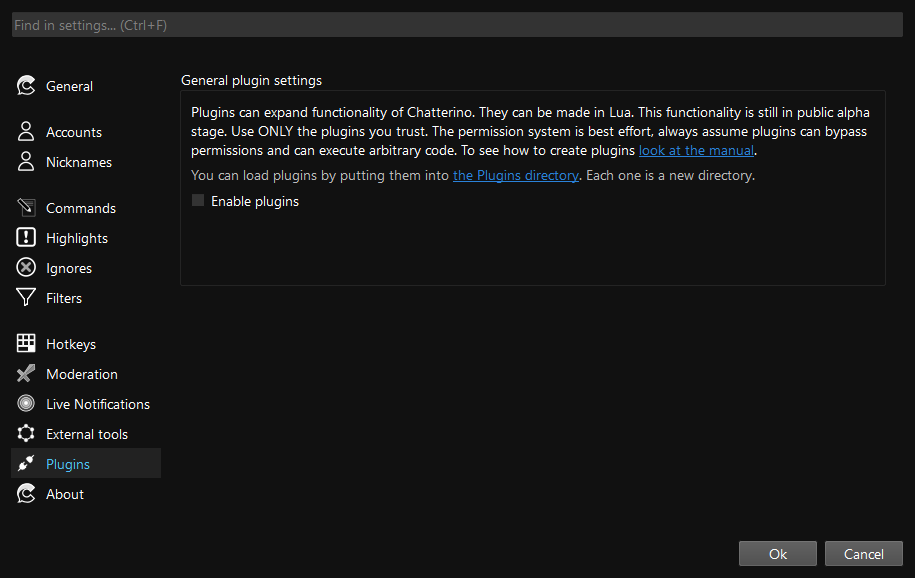
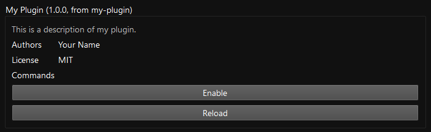

# Plugins Overview

Since version 2.5.2, you're able to extend Chatterino with Lua plugins. They allow you to extend the functionality of Chatterino in various ways, such as adding new commands or custom tab-completions.

<!-- prettier-ignore -->
!!! note
    Version 2.5.2 is not yet released. You can try out the plugin system by downloading the latest [nightly build](../Help.md#what-is-nightly-and-how-to-use-install-it).

<!-- prettier-ignore -->
!!! warning
    The plugin system is still in development. The API is subject to change, and some features might not work as expected. If you encounter any issues, please report them on the [Chatterino GitHub repository](https://github.com/Chatterino/chatterino2/issues).

## Getting Started

Plugins are disabled by default. To enable them, open the settings, go to `Plugins` and check the `Enable plugins` checkbox.
If you don't see such a checkbox, you're likely using an older version of Chatterino.

<details><summary>Screenshot</summary>



</details>

In the settings, there's also a button to open the plugin folder (_the `Plugins` directory_). Alternatively, you can navigate to the `Plugins` folder inside the [Chatterino folder](../Settings.md#where-is-my-chatterino-folder-located) manually.

Each plugin gets its own folder in the `Plugins` directory. Inside the folder, you can place the plugin metadata (`info.json`), the Lua script (`init.lua`) with its dependencies, and data files/resources (`data/`).

Your `Plugins` folder might look like this:

```text
Plugins/
├── MyPlugin/
│   ├── data/
│   │   └── my-data-file.txt
│   ├── info.json
│   └── init.lua
└── AnotherPlugin/
    ├── info.json
    └── init.lua
```

### Plugin Metadata

Each plugin must have an `info.json` file. It contains metadata about the plugin, such as the name, author, version, permissions, and description. The following is an example of an `info.json` file:

<!-- prettier-ignore -->
```json title="info.json"
{
    "$schema": /* (1)! */"https://raw.githubusercontent.com/Chatterino/chatterino2/master/docs/plugin-info.schema.json",
    "name": "My Plugin",
    "description": "This is a description of my plugin.",
    "authors": ["Your Name"],
    "version": "1.0.0",
    "license": "MIT"
}
```

1. The schema is not required, but it's recommended to include it. Many editors will use it to provide autocompletion and validation.

Take a look at [the reference](./reference.md) for all available fields.

## Your First Plugin

To create your first plugin, create a new folder inside the `Plugins` directory. Inside the folder, create an `info.json` file (such as the one above) and an `init.lua` file. The `init.lua` file is the entry point of your plugin.

<!-- prettier-ignore-start -->
=== ":octicons-file-code-16: `init.lua`"
    ```lua
    c2.register_command("/hello-plugin", function(ctx)
        ctx.channel:add_system_message("Hello from my plugin!") -- (1)!
    end)
    ```

    1. In Lua, `#!lua v:method()` is equivalent to `#!lua v.method(v)`. The `add_system_message` method is called on the `ctx.channel` object with the message as an argument.
=== ":material-code-json: `info.json`"
    ```json
    {
        "$schema": "https://raw.githubusercontent.com/Chatterino/chatterino2/master/docs/plugin-info.schema.json",
        "name": "My Plugin",
        "description": "This is a description of my plugin.",
        "authors": ["Your Name"],
        "version": "1.0.0",
        "license": "MIT"
    }
    ```
=== ":material-file-tree: Directory Structure"
    ```text
    Plugins/
    └── my-plugin/
        ├── info.json
        └── init.lua
    ```
<!-- prettier-ignore-end -->

In the plugin settings, you can now enable your plugin by clicking on `Enable`:

<figure markdown="span">
    
</figure>

Now you can use the `/hello-plugin` command in any channel to see the message.

## Your Second Plugin

We can get more advanced by adding arguments to the command. The arguments are stored in the `#!lua ctx.words` table. The first element is the command itself, and the rest are the arguments. The input `/foo bar baz` would result in `#!lua ctx.words` being `#!lua {"/foo", "bar", "baz"}` for example. To recreate the input, you can use `#!lua table.concat(ctx.words, " ", 2)`. The second argument is the starting index, which is 2 in this case, because we want to skip the command itself. Table indices in Lua start at 1.

In the following example, we're going to convert the input to a "serif" version of the input. The serif version is a Unicode representation of the input where each letter is replaced with a math letter. For example, `Chatterino` becomes `𝐂𝐡𝐚𝐭𝐭𝐞𝐫𝐢𝐧𝐨`.

```lua title="init.lua"
local UPPER_A = 0x41         -- 'A'
local LOWER_A = 0x61         -- 'a'
local MATH_UPPER_A = 0x1D400 -- 𝐀
local MATH_LOWER_A = 0x1D41A -- 𝐚

---@param s string
local function to_serif(s)
    local codepoint = s:byte(1)
    if codepoint >= LOWER_A then
        return utf8.char(MATH_LOWER_A + (codepoint - LOWER_A))
    end
    return utf8.char(MATH_UPPER_A + (codepoint - UPPER_A))
end

c2.register_command("/serif", function(ctx)
    local arguments = table.concat(ctx.words, " ", 2)
    local serif = arguments:gsub("%a", to_serif)

    ctx.channel:send_message(serif, false)
end)
```

Try running `/serif Chatterino` in any channel to see the serif version of the input.

For a more involved example, check out the [Weather example](./weather-example.md).
